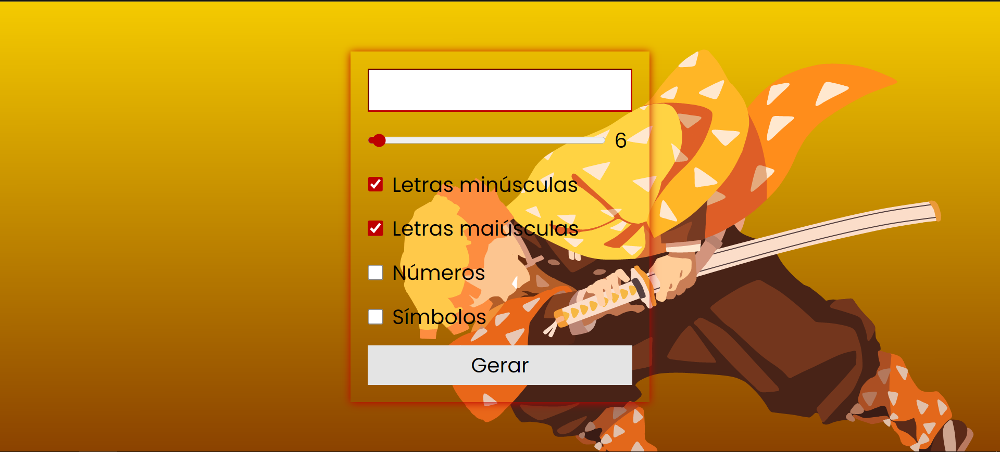

# ⚡ Gerador de Senhas — Tema Zenitsu

> Gere senhas seguras com estilo — inspirado no Pilar do Trovão de Demon Slayer.



---

## 📋 Sobre o Projeto

Aplicação web para geração de senhas aleatórias e seguras diretamente no navegador, sem necessidade de backend ou instalação. O usuário controla o comprimento e os tipos de caracteres incluídos na senha.

---

## ✨ Funcionalidades

- 🔢 Incluir **números** (0–9)
- 🔣 Incluir **símbolos** (`!`, `@`, `#`, `$`, `%`)
- 🔡 Incluir **letras minúsculas** (a–z)
- 🔠 Incluir **letras maiúsculas** (A–Z)
- 📏 Controle de **comprimento** via slider (6 a 24 caracteres)
- 📋 Exibição da senha gerada em campo de texto
- 🔁 Botão "Copiar" para copiar a senha com um clique

---

## 🛠️ Tecnologias Utilizadas

| Tecnologia | Uso |
|---|---|
| HTML5 | Estrutura da página |
| CSS3 | Estilização e layout responsivo |
| JavaScript (Vanilla) | Lógica de geração de senhas |
| Google Fonts (Poppins) | Tipografia |

---

## 🚀 Como Usar

1. **Clone ou baixe** o repositório
2. Abra o arquivo `index.html` no navegador
3. Selecione as opções desejadas (tipos de caractere e comprimento)
4. Clique em **"Gerar"**
5. Clique em **"Copiar"** para copiar a senha para a área de transferência

> ⚠️ Nenhuma senha é armazenada ou enviada para servidores. Tudo acontece localmente no seu navegador.

---

## 📁 Estrutura de Arquivos

```
password-generator/
├── index.html      # Estrutura HTML da aplicação
├── style.css       # Estilos visuais e tema
├── script.js       # Lógica de geração de senhas
├── fundo.png       # Imagem de fundo (Zenitsu - Demon Slayer)
└── README.md       # Documentação do projeto
```

---

## 🎨 Tema Visual

A interface usa como plano de fundo uma arte minimalista do **Zenitsu Agatsuma**, personagem do anime *Demon Slayer: Kimetsu no Yaiba*, com paleta de cores em tons de dourado, laranja e vermelho escuro — referência ao estilo de respiração do Trovão.

---

## 📌 Melhorias Implementadas (v2)

- ✅ Botão **"Copiar"** com feedback visual
- ✅ Indicador de **força da senha** (Fraca / Média / Forte)
- ✅ Aviso quando nenhum tipo de caractere é selecionado
- ✅ Campo de senha com **botão de limpeza**
- ✅ Layout mais refinado e responsivo
- ✅ Animação suave no botão Gerar

---

## 👨‍💻 Autor

Desenvolvido por **Thyago Paula**  
📧 Thyagopaula22@gmail.com

---

## 📄 Licença

Este projeto é de uso livre para fins educacionais e pessoais.
